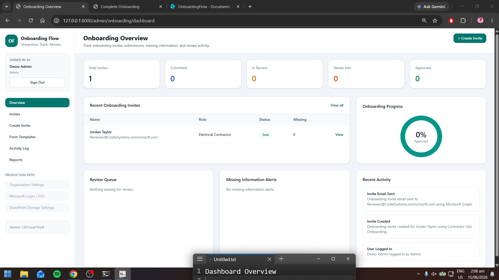
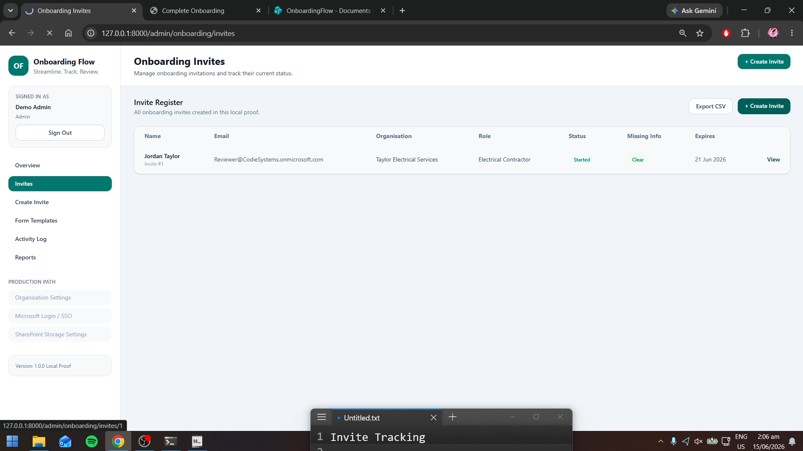
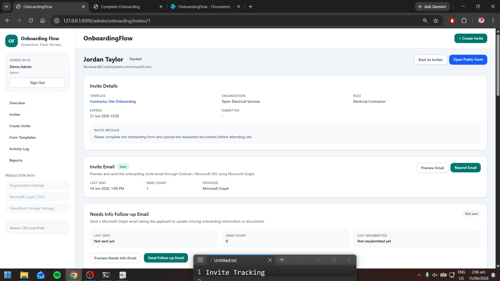
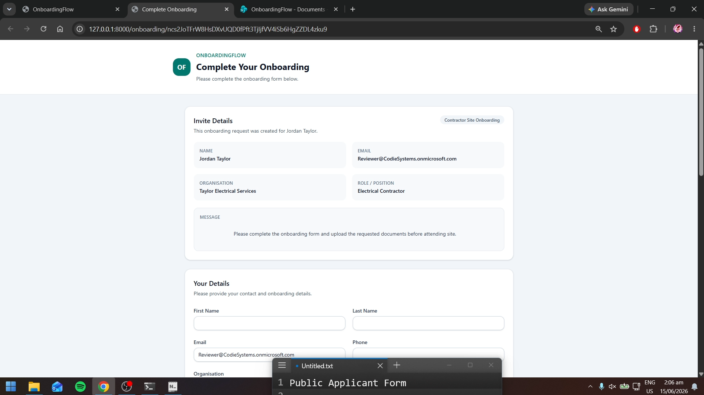
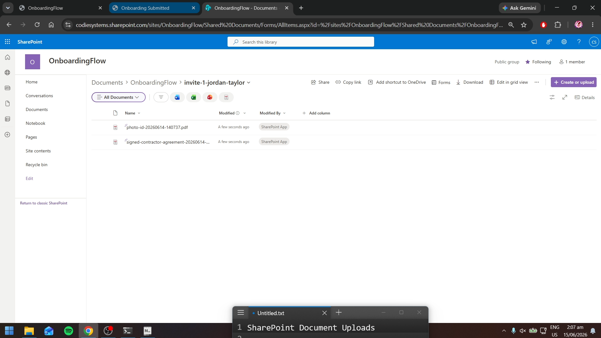
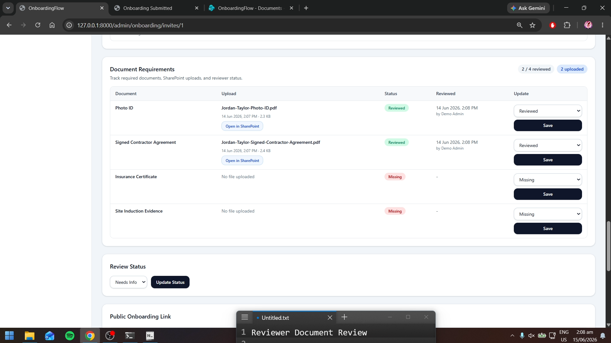
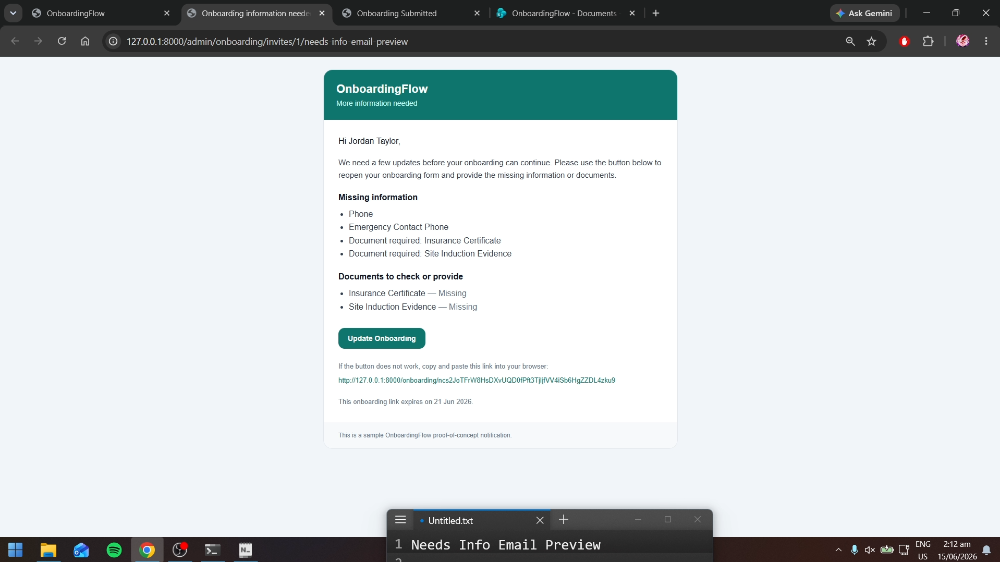
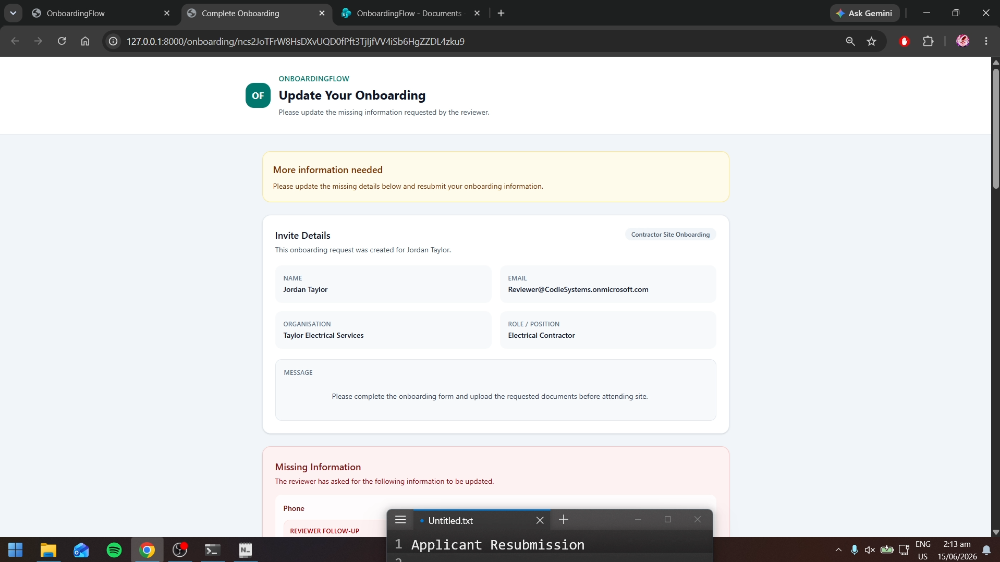
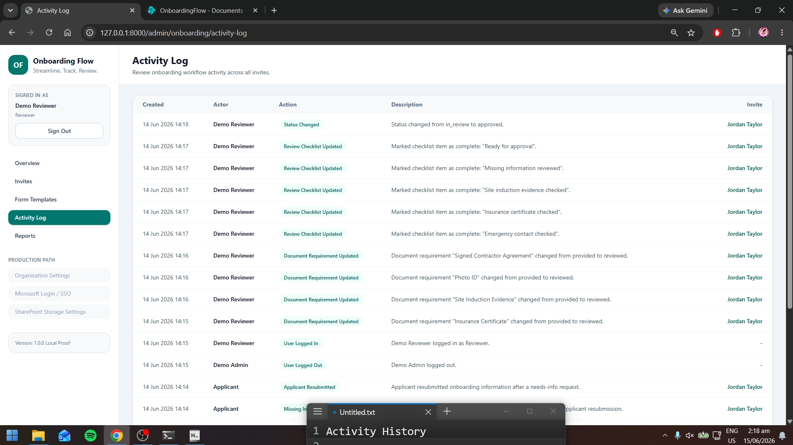
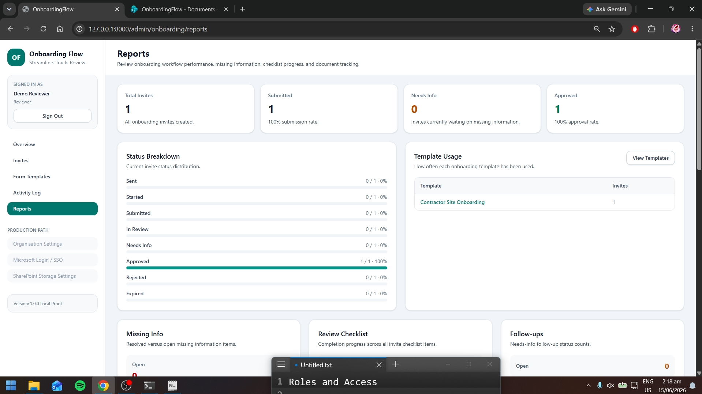

# OnboardingFlow

OnboardingFlow is a Laravel/MySQL proof-of-concept for a trackable onboarding workflow.

It was built as a standalone sample-data project to demonstrate how an onboarding process could move from manual emailed documents into a structured review workflow with invites, submissions, document requirements, review steps, missing-information follow-up, SharePoint-backed uploads, reporting, and activity history.

This proof is **not connected to OSHE systems** and is **not production-ready**. It is intended as a safe visual and technical proof-of-concept.

---

## Project Summary

OnboardingFlow demonstrates a complete onboarding review loop:

1. An admin creates an onboarding template.
2. An admin creates an invite for an applicant.
3. The applicant opens a public onboarding link.
4. The applicant submits details and uploads required documents.
5. Uploaded documents are stored through SharePoint.
6. A reviewer checks the submission, checklist, and document requirements.
7. If information is missing, the reviewer can request updates.
8. The applicant can reopen the same link and resubmit.
9. The reviewer continues review and can approve the onboarding.
10. Activity history and reports show the workflow trail.

The purpose of the proof is to make the workflow easier to review visually before any real pilot or production work is considered.

---

## Screenshots

Place screenshots in:

```text
docs/screenshots/
```

The README embeds the expected screenshot filenames below. Once the files are added with these names, GitHub will display them automatically.

### 01 — Dashboard



### 02 — Invite List



### 03 — Invite Detail / Review Workflow



### 04 — Public Onboarding Form



### 05 — SharePoint Uploaded Documents



### 06 — Document Review



### 07 — Needs Info Email Preview



### 08 — Public Resubmission Form



### 09 — Reports


### 10 — Activity Log



### 11 — Role Display



---

## What It Demonstrates

- Template-based onboarding invites
- Public applicant onboarding form
- Submission tracking
- Required document tracking
- SharePoint-backed document uploads
- Reviewer checklist
- Missing-information detection
- Missing-information follow-up messages
- Applicant resubmission workflow
- Admin / Reviewer / Read-only roles
- Activity history / audit trail
- Reports page
- CSV export
- Microsoft Graph invite email sending
- Microsoft Graph needs-info follow-up email sending
- Microsoft 365 integration path

---

## Tech Stack

- Laravel
- PHP
- MySQL
- Blade
- Tailwind CSS
- Microsoft Graph
- Outlook email sending
- SharePoint document storage

---

## Recommended Demo Path

1. Log in as admin.
2. Open the dashboard.
3. Open the invite list.
4. Open an onboarding invite.
5. Open the public applicant form.
6. Submit applicant details and upload required documents.
7. Confirm uploaded files appear in SharePoint.
8. Review uploaded documents from the admin/reviewer screen.
9. Mark the invite as Needs Info.
10. Preview or send the needs-info follow-up email.
11. Open the same public link in resubmission mode.
12. Resubmit missing information and documents.
13. Log in as reviewer.
14. Complete document review and checklist items.
15. View the activity log and reports.

---

## Demo Users

After seeding:

```text
admin@example.com / password
reviewer@example.com / password
readonly@example.com / password
```

### Admin

Admin users can:

- Create templates
- Create invites
- Send invite emails
- Review submissions
- Update document status
- Add notes
- Send needs-info emails
- Export CSV
- View reports and activity history

### Reviewer

Reviewer users can:

- Review submissions
- Update checklists
- Mark documents provided/reviewed/missing/not required
- Add missing-information follow-ups
- Send needs-info emails
- Add notes
- Export CSV
- View reports and activity history

Reviewer users cannot:

- Create invites
- Create templates
- Send original invite emails

### Read-only

Read-only users can:

- View dashboards
- View invites
- View templates
- View reports
- View activity history

Read-only users cannot:

- Create records
- Send emails
- Update review fields
- Upload or review documents
- Add notes
- Export CSV

---

## Environment Configuration

Copy `.env.example` to `.env` and configure the local database and Microsoft 365 values as required.

Real secrets, tenant IDs, client secrets, and production configuration values should never be committed to source control.

Example placeholders:

```env
ONBOARDING_EMAIL_PROVIDER=microsoft_graph
ONBOARDING_DOCUMENT_STORAGE_PROVIDER=sharepoint

MICROSOFT_TENANT_ID=
MICROSOFT_CLIENT_ID=
MICROSOFT_CLIENT_SECRET=
MICROSOFT_MAIL_FROM=

MICROSOFT_SHAREPOINT_SITE_ID=
MICROSOFT_SHAREPOINT_DRIVE_ID=
MICROSOFT_SHAREPOINT_FOLDER=OnboardingFlow
```

---

## Local Setup

Install dependencies:

```bash
composer install
npm install
```

Create app key:

```bash
php artisan key:generate
```

Run migrations and seed demo users:

```bash
php artisan migrate
php artisan db:seed --class=DemoUserSeeder
```

Run the app:

```bash
php artisan serve
npm run dev
```

Open:

```text
http://127.0.0.1:8000/login
```

---

## Microsoft 365 Setup Notes

OnboardingFlow uses Microsoft Graph as one possible integration path for email sending and SharePoint document storage.

This proof-of-concept uses sample data and is not connected to OSHE systems.

### Required Microsoft Graph Application Permissions

The app registration requires Microsoft Graph application permissions for the proof:

- `Mail.Send`
- `Sites.ReadWrite.All`
- `Files.ReadWrite.All`

Admin consent must be granted in Microsoft Entra.

### Important Permission Note

Graph Explorer permissions are only useful for testing Graph requests and finding IDs manually.

The Laravel app uses the app registration credentials from `.env`, so the app registration itself must have the required Microsoft Graph application permissions and admin consent.

### Email Sending

Invite emails and needs-info follow-up emails are sent through Microsoft Graph using the configured Microsoft 365 mailbox.

The proof successfully tested internal tenant delivery.

### External Delivery Limitation

External delivery from a new or development Microsoft 365 tenant may be blocked by Microsoft outbound protection, including NDR code:

```text
550 5.7.708 Access denied, traffic not accepted from this IP
```

This is a Microsoft 365 tenant/mail reputation limitation, not an application workflow failure.

For a real pilot, external sending should use the organisation's production tenant/domain, proper SPF/DKIM/DMARC configuration, and Microsoft support clearance if required.

### SharePoint Document Storage

Required document uploads are stored in SharePoint through Microsoft Graph.

Each document requirement stores SharePoint metadata, including:

- Drive ID
- Item ID
- Web URL
- Original filename
- MIME type
- File size
- Upload timestamp

---

## Production Readiness Notes

OnboardingFlow is currently a proof-of-concept using sample data.

It demonstrates a possible workflow direction for tracked onboarding invites, applicant submissions, document requirements, reviewer actions, missing-information follow-up, reporting, and audit history.

### Working in the Proof

| Area | Proof Status |
|---|---|
| Invites | Template-based invites are working |
| Applicant form | Public onboarding form is working |
| Documents | Required document tracking is working |
| SharePoint uploads | Files upload to SharePoint through Microsoft Graph |
| Review checklist | Reviewer checklist is working |
| Missing info | Missing-information follow-up and resubmission flow is working |
| Roles | Admin, Reviewer, and Read-only roles are working |
| Email | Microsoft Graph invite and needs-info emails are working internally |
| Reports | Reports page and CSV export are working |
| Activity log | Workflow actions are logged with actor attribution |

### Proof vs Production

| Area | Proof Status | Production Requirement |
|---|---|---|
| Email | Microsoft Graph works internally | Production tenant/domain deliverability review |
| Documents | SharePoint upload works | Retention, permissions, malware scanning, file policy |
| Auth | Local demo users | Organisation login / SSO / access policy |
| Data | Sample data | Approved real data model |
| Deployment | Local Laravel app | Hosted environment, backups, monitoring |
| Secrets | Local `.env` | Secure secrets management |
| Audit | Activity log proof | Formal audit retention policy |
| Privacy | Sample data only | Privacy review and data handling policy |

### Not Production-Ready Yet

Before a real pilot or production deployment, the following would need review:

- Security review
- Privacy review
- Real organisation data requirements
- User acceptance testing
- Error handling and monitoring
- Backup and recovery process
- Data retention policy
- Access control review
- Microsoft 365 tenant/domain configuration
- Deployment process
- Logging and audit retention
- Email deliverability review
- File upload restrictions and malware scanning
- Secrets management

---

## Known Limitations

This proof is intentionally limited.

Known limitations include:

- It uses sample data only.
- It is not connected to OSHE systems.
- It is not production-hardened.
- Local demo users are used instead of organisation SSO.
- Microsoft 365 external delivery may be blocked from a new/development tenant.
- File upload security requires production review.
- SharePoint permissions and retention rules require production planning.
- Error handling and monitoring are proof-level only.
- No formal privacy review has been completed.
- No malware scanning workflow has been added.
- No production backup/restore plan has been implemented.
- The current workflow is based on assumed onboarding requirements and would need stakeholder validation.

---

## Pilot Next Steps

A possible pilot path would be:

1. Review the workflow with stakeholders.
2. Confirm the real onboarding fields.
3. Confirm the required document types.
4. Confirm whether Microsoft 365 is the preferred integration path.
5. Confirm email and SharePoint ownership.
6. Replace sample data with approved test data.
7. Review access roles and approval rules.
8. Review privacy and retention requirements.
9. Harden authentication and file handling.
10. Deploy to a controlled pilot environment.
11. Run user acceptance testing.
12. Gather feedback.
13. Decide whether to continue, revise, or retire the proof.

---

## Manual QA Checklist

### Admin

- [ ] Can log in as admin
- [ ] Can view dashboard
- [ ] Can create onboarding template
- [ ] Can create onboarding invite
- [ ] Can preview invite email
- [ ] Can send invite email through Microsoft Graph
- [ ] Can view invite details
- [ ] Can update invite status
- [ ] Can add internal notes
- [ ] Can update review checklist
- [ ] Can update document requirement status
- [ ] Can view reports
- [ ] Can export CSV

### Applicant

- [ ] Can open public onboarding link
- [ ] Can view invite details
- [ ] Can submit onboarding form
- [ ] Can upload required documents
- [ ] Uploaded documents appear in SharePoint
- [ ] Can reopen same link when invite is marked Needs Info
- [ ] Can update missing information
- [ ] Can upload missing documents
- [ ] Resubmission returns invite to In Review

### Reviewer

- [ ] Can log in as reviewer
- [ ] Can view dashboard
- [ ] Can view invites
- [ ] Can update review checklist
- [ ] Can mark documents Provided / Reviewed / Missing / Not Required
- [ ] Can add missing-information follow-up
- [ ] Can send needs-info email
- [ ] Can add internal notes
- [ ] Can export CSV
- [ ] Cannot create invite
- [ ] Cannot create template
- [ ] Cannot send original invite email

### Read-only

- [ ] Can log in as read-only
- [ ] Can view dashboard
- [ ] Can view invite details
- [ ] Can view templates
- [ ] Can view reports
- [ ] Can view activity log
- [ ] Cannot create invite
- [ ] Cannot create template
- [ ] Cannot send emails
- [ ] Cannot update review checklist
- [ ] Cannot update document status
- [ ] Cannot add notes
- [ ] Cannot export CSV

### Microsoft 365

- [ ] Invite email sends internally through Microsoft Graph
- [ ] Needs-info email sends internally through Microsoft Graph
- [ ] Uploaded files appear in SharePoint
- [ ] SharePoint file links open from admin invite detail
- [ ] External personal Outlook delivery limitation documented

### Activity Log

- [ ] Invite creation is logged
- [ ] Applicant form opened is logged
- [ ] Applicant submission is logged
- [ ] Document upload is logged
- [ ] Reviewer actions show reviewer name
- [ ] Needs-info email send is logged
- [ ] Applicant resubmission is logged

---

## Demo Video Plan

Recommended length: 5 to 13 minutes depending on whether it is a quick overview or full walkthrough.

### Video Style

- Screen recording only
- Minimal speaking
- Clean intro voiceover
- Text/caption cards during the workflow
- Clean closing voiceover
- No code explanation required
- No secrets or private tabs visible

### Opening Script

```text
Hi Vanessa, this is a separate proof-of-concept using sample data. It is not connected to OSHE systems.

I built it to make the onboarding workflow easier to review visually, based on the kind of process we discussed.

It demonstrates tracked invites, a public onboarding form, document requirements, reviewer checks, missing-information follow-up, SharePoint-style document storage, reporting, and activity history.

This is not production-ready yet, but it shows a possible workflow direction for review and discussion.
```

### Demo Order

1. Dashboard
2. Invite list
3. Invite detail
4. Public onboarding form
5. Document upload
6. SharePoint uploaded file
7. Reviewer checklist and document review
8. Needs-info follow-up email preview
9. Public resubmission mode
10. Activity log
11. Reports
12. Roles and access

### Closing Script

```text
That is the main workflow.

I kept this as a separate sample-data proof so it can be reviewed safely without touching any real OSHE systems.

This is not production-ready yet, but it shows a possible workflow direction and what would need to be hardened for a real pilot.
```

---

## Documentation

The `docs` folder may also contain standalone versions of the project notes:

- `docs/project-summary.md`
- `docs/demo-script.md`
- `docs/demo-video-plan.md`
- `docs/manual-qa-checklist.md`
- `docs/microsoft-365-setup.md`
- `docs/production-readiness.md`
- `docs/known-limitations.md`
- `docs/pilot-next-steps.md`
- `docs/screenshots/`

---

## Safe Demo Framing

This project uses sample data and is separate from any real organisation systems.

It should be treated as a visual and technical proof-of-concept, not a production system.
